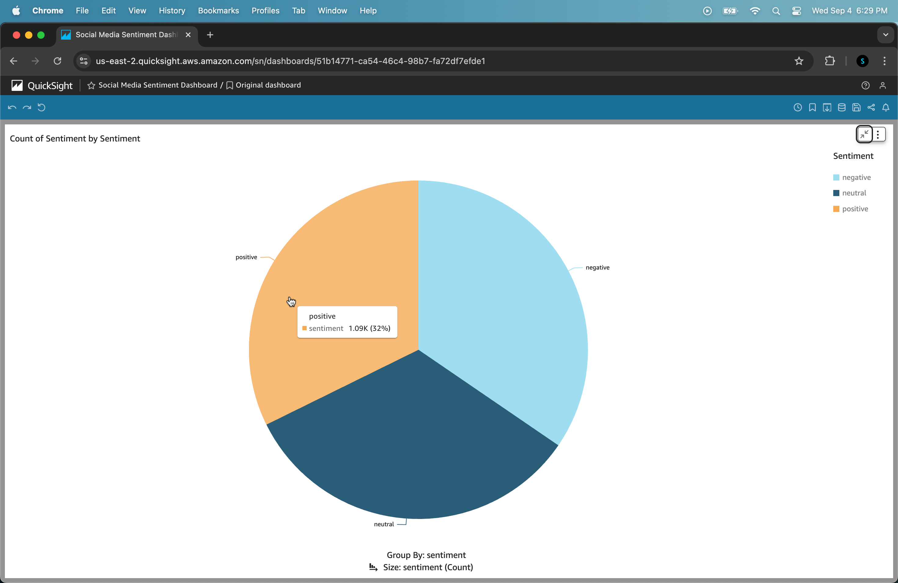
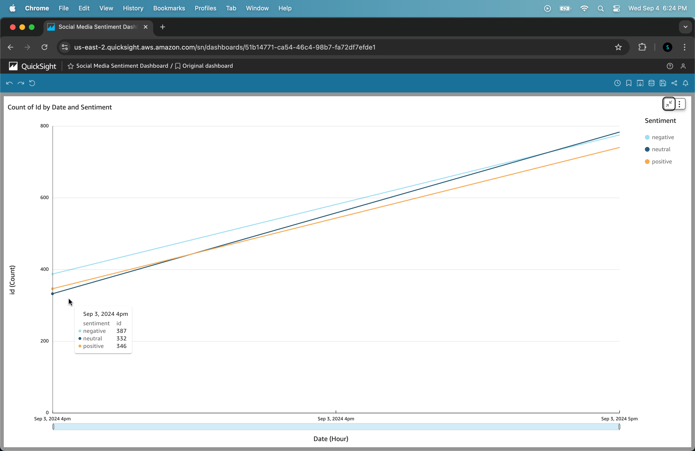
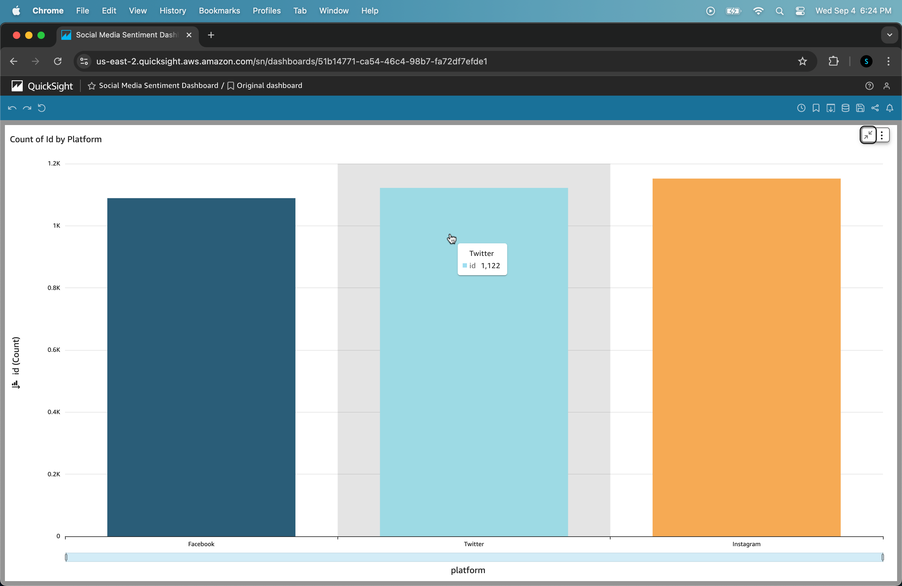

# Real-time Social Data Analytics Pipeline

## Project Overview

Real-time Social Data Analytics Pipeline is an advanced data engineering project that demonstrates proficiency in building scalable, real-time data processing systems using cutting-edge AWS cloud technologies. This project simulates a production-grade pipeline for ingesting, processing, and analyzing social media data in real-time.

## Technical Stack

- **Data Ingestion:** AWS Kinesis Data Streams
- **Data Processing:** AWS Lambda
- **Data Storage:** Amazon S3, Amazon DynamoDB (NoSQL database)
- **Data Warehousing:** Amazon Redshift
- **Data Visualization:** Amazon QuickSight
- **Workflow Orchestration:** AWS Step Functions
- **Infrastructure as Code:** AWS CloudFormation
- **CI/CD:** AWS CodePipeline, AWS CodeBuild
- **Monitoring:** Amazon CloudWatch
- **Security:** AWS IAM, AWS KMS

## Key Features

1. **Real-time Data Streaming:** Ingest high-volume social media data using Kinesis Data Streams.
2. **Serverless Architecture:** Utilize AWS Lambda for scalable, event-driven data processing.
3. **Sentiment Analysis:** Perform real-time sentiment analysis on incoming social media posts. (Mock data)
4. **Data Lake Implementation:** Store raw and processed data in a well-organized S3-based data lake.
5. **NoSQL and Data Warehouse Integration:** Use DynamoDB for rapid access to recent data and Redshift for complex analytical queries.
6. **Real-time Dashboarding:** Create dynamic, real-time dashboards using Amazon QuickSight.
7. **Automated Workflow:** Orchestrate complex data workflows using Step Functions.
8. **Infrastructure as Code:** Define and version entire infrastructure using CloudFormation.
9. **Continuous Integration and Deployment:** Implement CI/CD pipelines for both infrastructure and application code.
10. **Comprehensive Monitoring:** Set up detailed monitoring and alerting using CloudWatch.

## Demonstrated Skills

- Designing and implementing scalable, cloud-native data architectures
- Building real-time data processing pipelines
- Implementing serverless and event-driven architectures
- Applying best practices in data lake and data warehouse design
- Utilizing NoSQL databases for high-throughput scenarios
- Creating data visualizations and dashboards
- Implementing Infrastructure as Code (IaC) principles
- Setting up CI/CD pipelines for data engineering projects
- Ensuring data security and compliance in cloud environments
- Optimizing cloud resource usage and costs

## Data Visualization

## Technical Summary

The Real-time Social Data Analytics Pipeline is a comprehensive, cloud-native solution leveraging AWS services to create a scalable, serverless data processing system. The pipeline ingests social media data through Amazon Kinesis Data Streams, processes it using AWS Lambda functions for sentiment analysis, and stores results in Amazon DynamoDB and Amazon Redshift for quick access and complex analytical queries respectively. AWS Step Functions orchestrates the workflow, ensuring reliable execution and error handling, while Amazon QuickSight enables intuitive data visualization of social media trends and sentiments. The entire infrastructure is defined and deployed using AWS CloudFormation, with CI/CD implemented via AWS CodePipeline and CodeBuild, automating build, test, and deployment processes. Security is ensured through AWS IAM and KMS, with sensitive information managed by AWS Systems Manager Parameter Store, while monitoring and logging are handled by Amazon CloudWatch, providing comprehensive insights into the pipeline's health and performance. This project demonstrates advanced use of AWS services, showcasing best practices in cloud architecture including serverless computing, infrastructure as code, CI/CD, security, and monitoring.
